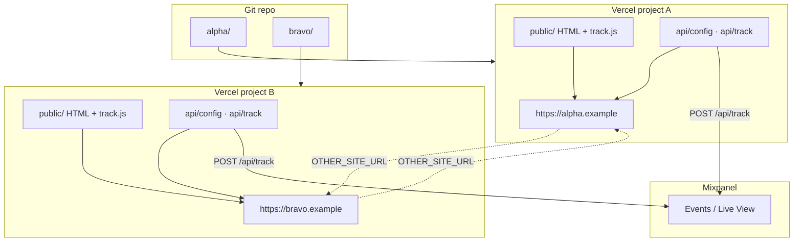
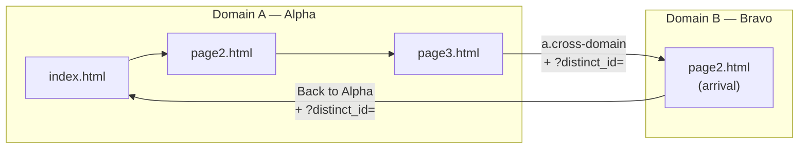
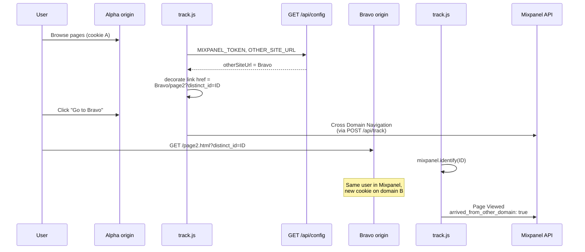
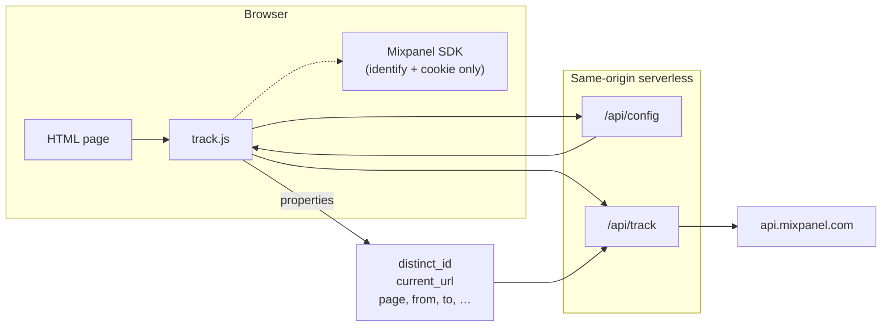
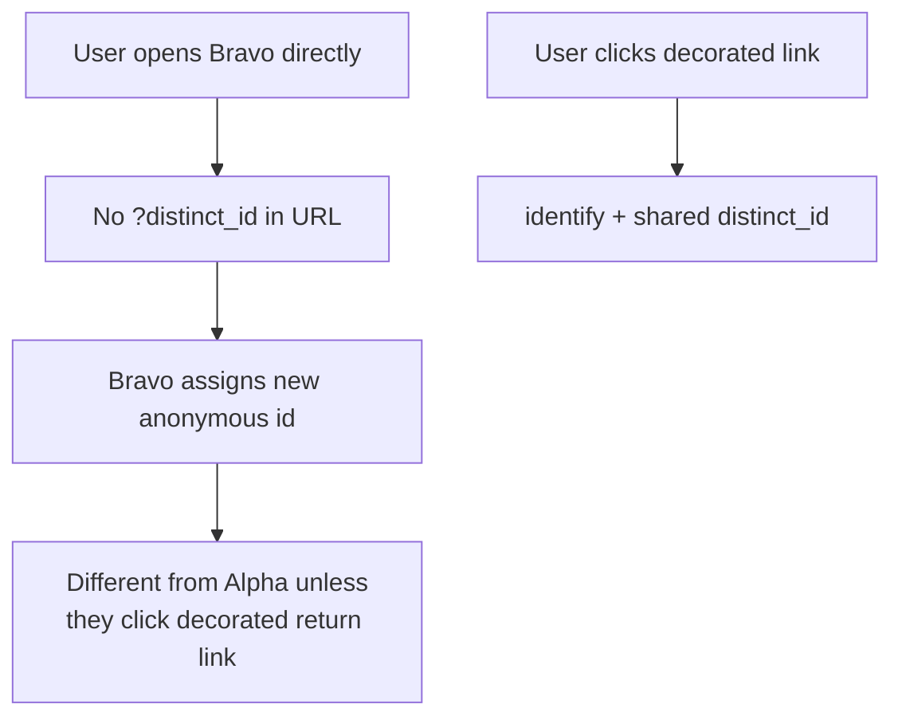
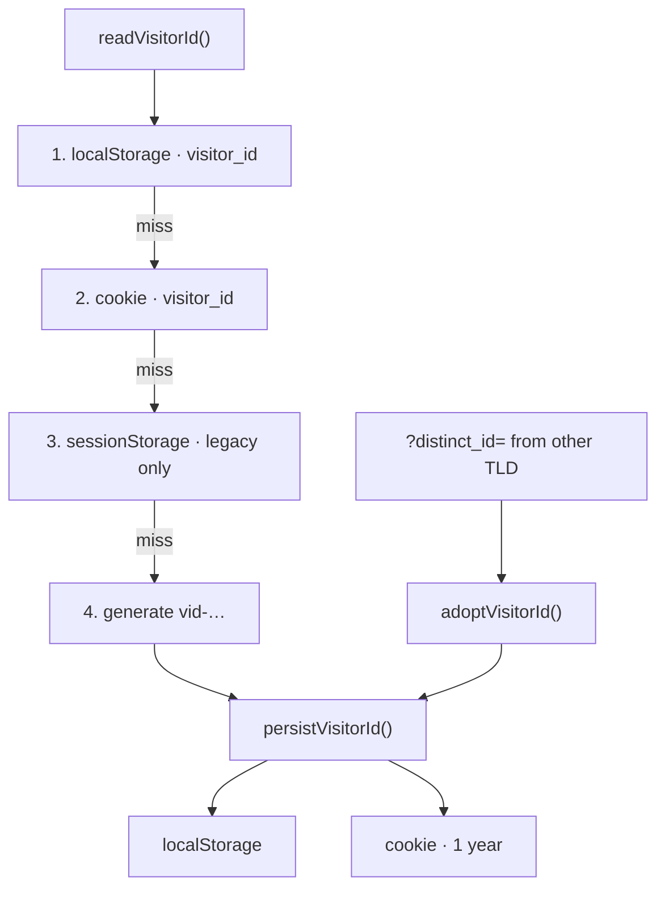
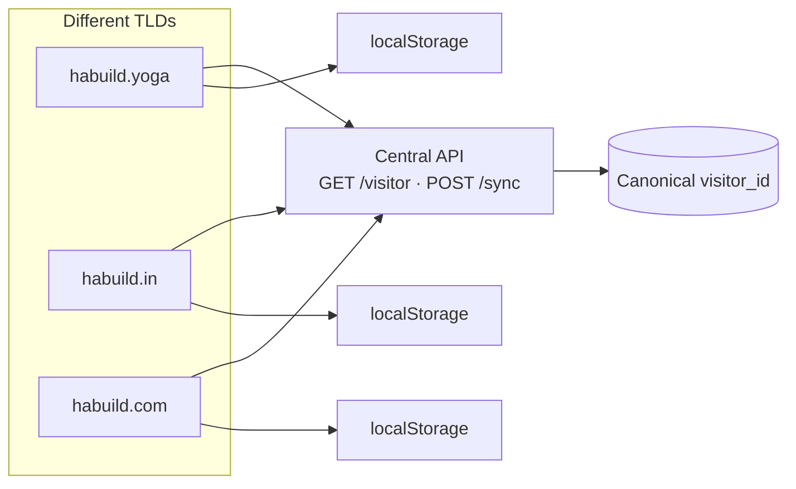

# Cross-domain Mixpanel PoC — architecture

## System overview

## Page flow (domain A → B → A)

## Cross-domain stitch (link decoration)

## Event pipeline (per page load)

## What does *not* stitch users

## Visitor ID storage (per domain)

**Per origin only.** `habuild.yoga`, `habuild.in`, and `habuild.com` each get their own localStorage + cookie. Cross-TLD stitch still needs URL handoff or a central server (below).

## Multi-TLD production (e.g. habuild.yoga / .in / .com)

| Approach | Reliability | Best for |
|----------|-------------|----------|
| **Link decoration + `?distinct_id=`** (this PoC) | Medium — click-only | Marketing links, email CTAs, known cross-domain paths |
| **localStorage + cookie per domain** | High on *one* TLD | Return visits on the same hostname |
| **Central visitor API** | High across TLDs | Same brand, multiple domains — **recommended production** |
| **Chrome extension bridge** | High for extension users only | Optional boost, not a primary strategy |

**Recommended stack for HaBuild:**

1. **Central server** — one canonical `visitor_id` (UUID), keyed by device signals + optional login.
2. **On each domain load** — read local `visitor_id`; if missing or stale, call central API; write to **localStorage + cookie**.
3. **Link decoration** — still decorate outbound links with `?distinct_id=` as a fast path (works without API round-trip).
4. **Mixpanel** — `identify(canonical_id)` on every domain after sync.
5. **Extension** — optional; sync localStorage across TLDs for power users, not required for analytics accuracy.

Cookies or localStorage **alone cannot share** across `.yoga`, `.in`, and `.com` (different site origins). Server-side canonical ID is the only reliable always-on solution; this PoC demonstrates the **client handoff** piece of that puzzle.

## Environment variables (mirrored)

| Project | `MIXPANEL_TOKEN` | `OTHER_SITE_URL` |
|---------|------------------|------------------|
| Alpha   | same token       | Bravo’s origin   |
| Bravo   | same token       | Alpha’s origin   |
